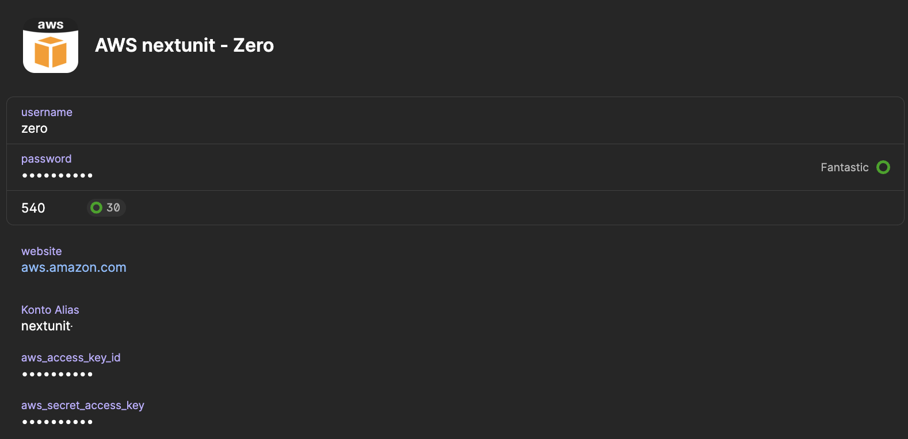

# op2aws
CLI Tool to use 1password for credentials to login into AWS. It is possible to use it in connection with multifactor authentication (2FA)
and assuming another role automatically.


## Installing

You can download the executables for linux, windows and mac as release zip files in the [release](https://github.com/nextunit-io/op2aws/releases) area.

### Prerequesits

To run `op2aws` in your CLI, it is required to run [1password](https://1password.com/) (tested with version 8) and the [CLI plugin for 1password](https://1password.com/downloads/command-line/).

### Homebrew

On Mac you can use homebrew to install op2aws:

```bash
brew install nextunit-io/tab/op2aws
```

After this installation the command `op2aws` is available.

## Features

- Authenticate against AWS with static credentials
- Authenticate against AWS with MFA
- Assume role after login
- Output the export variables for login: `$(op2aws cli ... --export)`
- Adding profiles to your `$HOME/.aws/config` file

## Getting started

To use `op2aws` you need to store your `AWS_ACCESS_KEY_ID` and `AWS_SECRET_ACCESS_KEY` in your 1password. 

Example:


### Adding new profiles to config file

The easiest way to add new profiles with the `op2aws` functionality is to use the CLI command

```bash
$ op2aws config
```

You are going to get asked some questions, where your credentials are stored:

```bash
$ op2aws config
? Enter new profile name: nextunit-profile
? Select credentials vault: nextunit.io
? Select credentials item: AWS nextunit - Zero
? Do you like to assume a specific role? Yes
? Enter the role arn you'd like to assume: arn:aws:iam::0000000000000:role/Administrator
? Do you like to configure MFA? Yes
? Enter the MFA arn you'd like to assume: arn:aws:iam::00000000000:mfa/zero
? Do you like to change the default label names for the AWS credentials in 1password? (aws_access_key_id, aws_secret_access_key) No
? Do you like to add to the config:

[profile nextunit-profile]
    credential_process = sh -c '"op2aws" "cli" "nextunit.io" "AWS nextunit - Zero" "-a" "arn:aws:iam::0000000000000:role/Administrator" "-m" "arn:aws:iam::00000000000:mfa/zero"'

Write now to $HOME/.aws/config? Yes
Added to config file.
```

If you store your credentials in other fields then `aws_access_key_id` or `aws_secret_access_key`, because e.g. you have multiple credentials in one 1password-item, you can select the
correct fields as well, by answering the question with `yes`.

### Using `op2aws cli`

`op2aws cli` is using caching, we don't want to generate everytime completely new credentials. If the old credentials are not expired, it is using this credentials.
The cache is stored at `$HOME/.aws/op2aws-cache`. To force recreation of the credentials, it is possible to use the `--force` (short `-f`) flag.

#### Using op2aws in the .aws/config file

AWS is providing [functioanlity](https://docs.aws.amazon.com/cli/latest/userguide/cli-configure-sourcing-external.html), called `credential_process` for the `.aws/config` File.
This allowes to use an external tool to provide the credentials for the login. In our case, we want to use `op2aws`. 

```bash
[profile <profile-name>]
    credential_process = sh -c '"op2aws" "cli" "<VAULT>" "<ITEM>" "-m" "<MFA ARN>" "-a" "<ASSUME ROLE>"'
```

To get the full list of parameters, use `op2aws cli --help`

#### Using op2aws directly in the cli without file support

It is possible to get the credentials directly as output from `op2aws`. Therefore the flag `--export `(short `-e`) is provided. 

```bash
$ op2aws cli nextunit.io "AWS nextunit - Zero" -a arn:aws:iam::0000000000000:role/Administrator -m arn:aws:iam::00000000000:mfa/zero --export

AWS_ACCESS_KEY_ID=*********
AWS_SECRET_ACCESS_KEY=************
AWS_SESSION_TOKEN=********************************************************************************************************************
```

So it is possible to directly export the variables with this command:

```bash
export $(op2aws cli nextunit.io "AWS nextunit - Zero" -a arn:aws:iam::0000000000000:role/Administrator -m arn:aws:iam::00000000000:mfa/zero --export)
```
